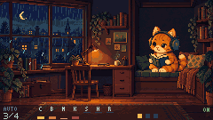

# Cardputer ADV Lofi

An offline, endless lofi radio for **M5Stack Cardputer ADV**. The ESP32-S3 composes chords, bass, melodies and drums while an original pixel-art cat reads in a rainy room.



**Development candidate · 0.1.3-dev.** The native preview and firmware share the music engine and 240 × 135 drawing code. An initial device run exposed an LCD byte-order bug; this update corrects the transfer and enlarges the status, control and help text. The corrected display, physical audio quality, timing, SD behavior and launcher return still need device verification. This is an independent project, inspired by the atmosphere of cozy study radio.

## What works in this implementation

- Seeded composition with three moods: Cozy, Rainy and Night.
- Layered openings with keys, bass and a soft groove from the first bar; related chord progressions, returning melody motifs, phrase variations, swing and automatic new sessions.
- Two sound candidates behind the same composer: pure synthesis, or a hybrid using a tiny bank of instrument/drum one-shots. **Both remain available for comparison.**
- An original cat with six animation poses in a cozy pixel-art room; quiet rain and steam. Reduced/still motion and a clean scene view.
- Pause, volume, mood selection, next session and up to eight favorites.
- Built-in music and artwork need **no SD, network, account or API key**. Optional SD stores settings and favorites; without it they remain in RAM until restart.
- A native SDL preview, deterministic WAV exports, real-code screenshot exports, sample tools and a local site generator.

External SD sample/scene packs and a final production engine choice remain later milestones. The hybrid bank is generated locally during development; it contains sound sources, not prerecorded songs. ElevenLabs effects are optional development auditions and are not bundled.

**Bluetooth audio:** the stock ADV's ESP32-S3 supports Bluetooth LE data, but neither Classic Bluetooth/A2DP nor LE Audio. Direct pairing with Bluetooth headphones/speakers is therefore unavailable. A standalone Bluetooth **transmitter** with a 3.5 mm analog input can use the ADV's headphone output; pairing belongs to that transmitter. An on-device wireless-output selector would require a supported external audio module or a separate network bridge. See [audio-output constraints](docs/ARCHITECTURE.md#bluetooth-audio-feasibility).

## Try it on desktop

Requirements: a C++17 compiler, CMake, and optionally SDL2 for the interactive window/audio. Export and test modes work without SDL2. On macOS, `brew install cmake sdl2` provides the native dependencies.

```sh
cmake -S . -B build/cmake -DCMAKE_BUILD_TYPE=Release
cmake --build build/cmake -j 4
ctest --test-dir build/cmake --output-on-failure
./build/cmake/lofi_native
```

For persistent desktop favorites, add `--state build/local-state.bin`. Explicit `--engine` / `--mood` flags override saved settings. The preview starts audio immediately at a modest master volume.

| Key | Action |
| --- | --- |
| Space | Play/pause |
| `-` / `=` | Volume |
| `M` / `N` | Mood menu / next session |
| `F` / `L` | Toggle favorite / favorite list |
| `V` / `S` / `H` | Clean scene / settings / help |
| `E` | Switch synth/hybrid at the next bar |
| `;` / `.` and `,` / `/` | Menu movement and adjustment |
| Enter / backtick or Escape | Select / back |
| Backspace | Remove selected favorite |
| Arrow keys / `Q` | Desktop menu movement / quit |

A favorite reproduces a session from its beginning with the same generation schema, parameters and bank. It does not restore the current playback position.

Version 0.1.3-dev retains generation schema 3 (`lofi3-` favorite codes) from 0.1.2-dev, so its settings and favorites remain compatible. Earlier schema-1/2 favorites remain visible as `OLD` and removable, while settings remain usable. Replay those favorites with the earlier firmware; the richer arrangement changes the score generated from their seed.

## Compare the sound engines

Use the same seed and mood for both candidates:

```sh
./build/cmake/lofi_native --engine synth --mood cozy --seed 0xCA7CAFE \
  --wav build/audio/cozy-synth.wav --seconds 180 --meta build/audio/cozy-synth.json
./build/cmake/lofi_native --engine hybrid --mood cozy --seed 0xCA7CAFE \
  --wav build/audio/cozy-hybrid.wav --seconds 180 --meta build/audio/cozy-hybrid.json
```

The event hash and count in the metadata establish whether both renders played the same score. Host render times are not ESP32 timing measurements. See [current verification](docs/VERIFICATION.md), [the engine comparison](docs/MUSIC_ENGINE.md) and [sample production](docs/SAMPLE_PRODUCTION.md).

For note-level inspection of harmony and phrase development, export the same shared composer as CSV. This renders offline and never opens an audio device:

```sh
./build/cmake/lofi_native --score build/score/cozy.csv --seconds 480 --mood cozy --seed 0xCA7CAFE
python3 tools/analyze_score.py build/score/cozy.csv --output build/score/cozy-analysis.json
```

The report checks scale/chord membership and passing-note resolution, and measures register movement and structural variety. It is evidence about composition rules, not a rating of how pleasant the music sounds.

## Build for Cardputer ADV

Install PlatformIO, then:

```sh
pio run -d firmware -e lofi-adv
python3 tools/build_release.py
```

Pinned stack: espressif32 `7.0.1`, M5Unified `0.2.17`, M5GFX `0.2.22`, M5Cardputer `1.1.1`. No PSRAM is assumed. Output is mono PCM16 at 32 kHz, with twelve bounded voices and fixed audio/scene storage. A post-build check enforces the conservative `0x140000` byte app profile.

Use **M5Apps → Installer → SD** with the application BIN. Follow the [installation guide](docs/INSTALL.md), including compatibility and SD details. The project does not include a whole-device flash or erase script. Build/package commands never flash the device.

## Samples, screenshots and site

Python 3 is required for the tools; media export additionally needs Pillow (`python3 -m pip install -r tools/requirements-media.txt`). Audio demo export also requires FFmpeg with the libmp3lame encoder. `render_audio.py` renders both engines with matching parameters and records WAV/MP3 hashes for the site.

```sh
python3 -m unittest discover -s tests -p 'test_*.py' -v
./build/cmake/lofi_native --shots build/screens --animation build/animation --frames 144
python3 tools/export_media.py
python3 tools/render_audio.py
python3 tools/build_site.py
python3 -m http.server 8080 --directory build/site
```

The built-in bank is reproducible from [generate_samples.py](tools/generate_samples.py); [prepare_samples.py](tools/prepare_samples.py) validates and emits the flash bank. Optional ElevenLabs generation happens on the development computer using an environment key, with bounded requests and private raw outputs. It is never part of firmware playback. See the tools' `--help` and [audio asset notes](assets/audio/README.md).

The room and cat masters were created with the built-in imagegen tool, then adapted to the LCD as indexed pixel assets. [Artwork sources and prompts](assets/source/imagegen-v1/README.md) are included. To rebuild the bundled scene after editing its sources, run `python3 tools/prepare_scene.py`, then rebuild the native preview and firmware. The device uses a 240 × 135 background, six 64 × 72 sprite containers and a shared 64-color palette; generation and image conversion happen only during development.

## Project map

`firmware/src/audio` contains the shared composer and instruments; `firmware/src/ui` the pixel renderer; `firmware/src/core` the controller and bounded save format; `firmware/src/platform` the ADV audio/keyboard/SD adapter. `native` supplies SDL and offline exports. `tools` builds assets, packages and the site.

The [accepted plan](docs/PROJECT_PLAN.md), [architecture](docs/ARCHITECTURE.md), [delivery milestones](docs/DELIVERY.md) and [decisions](docs/DECISIONS.md) describe the direction. [Verification](docs/VERIFICATION.md) distinguishes implemented behavior from remaining acceptance work.

[Lofi Cat](https://github.com/m0rg0t/lofi_cat), Hermes, Oracle and Agent informed the experience and development workflow. This project uses original cat/room graphics and original procedural music. See [sources and dependency licenses](docs/THIRD_PARTY.md). A project license will be selected before public release.
