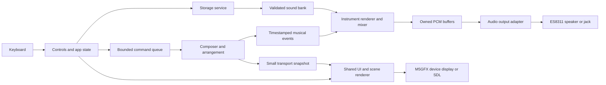

# Architecture

> Accepted design and milestone criteria. See [current implementation and verification](VERIFICATION.md) for what is built and measured; remaining targets below are not completion claims.

## Hardware basis

The stock ADV uses the ESP32-S3FN8, dual-core LX7 up to 240 MHz, 8 MB flash, a 240 × 135 ST7789V2 display, an ES8311 codec and a 3.5 mm output. Its speaker amplifier is disabled when a jack is inserted. The SoC has 512 KB SRAM; the FN8 package has no PSRAM. Budget against measured usable internal memory rather than treating all SRAM as free heap. [M5Stack hardware documentation](https://docs.m5stack.com/en/core/Cardputer-Adv), [Espressif datasheet](https://www.espressif.com/sites/default/files/documentation/esp32-s3_datasheet_en.pdf).

The first implementation should report free/minimum heap and largest allocatable block after display/audio initialization. Plan for stock hardware with no expansion modules. Verify balanced audible output at both sides of a normal headset, but promise mono music until the complete codec/jack path has been tested.

### Bluetooth audio feasibility

Checked against manufacturer documentation on 2026-09-13 following the request for a Bluetooth-output screen. ESP32-S3 supports Bluetooth LE, but neither Bluetooth Classic/A2DP nor LE Audio. Adding a BLE scan/pairing screen or an A2DP library cannot provide standard headphone/speaker audio on the stock radio. [Espressif Bluetooth audio chip comparison](https://docs.espressif.com/projects/esp-adf/en/latest/solution-center/bluetooth-audio.html), [ESP32-S3 Bluetooth capabilities](https://docs.espressif.com/projects/esp-idf/en/stable/esp32s3/api-guides/bt-architecture/overview.html).

The least invasive candidate is `ADV 3.5 mm output → standalone Bluetooth transmitter → headphones/speaker`. The ADV has a headphone output and disables its speaker amplifier when a jack is inserted. A transmitter must accept analog headphone audio and support transmission (TX/A2DP source); a receive-only adapter does not serve this purpose. The transmitter owns discovery/pairing/reconnection. An analog cable provides no connection-status or device-selection control channel to the Cardputer. This is an architectural option, not a tested hardware combination. [M5Stack ADV hardware](https://docs.m5stack.com/en/core/Cardputer-Adv), [manufacturer example of a headphone-jack transmitter](https://support.twelvesouth.com/en-US/articles/airfly-84725).

A functional Cardputer device-selection screen needs a specifically selected external audio module with a documented control interface and real connection events. Its audio input, pin/power requirements, framing, sample rate and buffering must be validated before integration. A Wi-Fi stream to a phone/computer that then outputs to its paired Bluetooth device is another possible architecture, requiring a receiver and new networking work. Neither route is selected or implemented. Keep the current speaker/jack output and shared composer working while a transport is chosen; no Bluetooth search/connected states are simulated in firmware.

## Modules



Suggested future layout:

```text
firmware/
  platformio.ini
  include/lofi/
  src/core/             # composer, transport, seeds, presets
  src/audio/            # voices, instruments, mixer, output adapter
  src/ui/               # real shared drawing and scene code
  src/platform/         # M5Cardputer, storage, controls, diagnostics
  src/sim/              # desktop adapters and scenario runner
  sim/stubs/
tools/                  # banks, native WAVs, screen exports, site, release checks
assets/source/          # editable pixel artwork + provenance
assets/audio/           # sample briefs, original responses/renders, selected masters, manifests
sdcard/LOFI/            # optional distributable content; no private state
site/                   # static page templates, styles and public copy
docs/media/             # selected generated captures and media manifest
tests/                  # meaningful host tests
```

The implementation now uses shared `firmware/src/audio`, `firmware/src/core`, and `firmware/src/ui`, with the ADV adapter in `firmware/src/platform` and SDL/export adapter in `native`. The outline above remains the conceptual design.

## Toolchain proposal

Start with the common local reference pins: PlatformIO `espressif32@7.0.1`, board `m5stack-stamps3`, Arduino framework, M5Unified `0.2.17`, M5GFX `0.2.22`, M5Cardputer `1.1.1`, and C++17. These are inspected reference versions, not a claim that they are latest. Confirm that they still resolve and support the required ADV paths during milestone 0.

Pin the same graphics revision for device and native preview. The Agent preview currently allows a different revision; do not copy that mismatch by default. Keep SDL/stubs out of the firmware build. Use native tests for the core and a native audio renderer; use the real screen/scene code in `native-sim`.

Avoid bringing over network, JSON, IR or Bluetooth libraries just because a reference uses them. Use the pinned M5Unified output adapter first; a direct I2S backend is a fallback if measurements establish a limitation. Do not combine incompatible legacy/new I2S APIs. The exact ESP-IDF version supplied by the pinned platform, rather than the current web manual, determines available APIs.

## Scheduling and ownership

At 32 kHz, a block of 512 mono samples lasts 16 ms and contains 1,024 bytes. Six application blocks occupy 6 KiB and span 96 ms before additional driver buffering. The driver DMA buffers and scratch buffers are extra allocations and must be measured.

One audio producer owns synthesis state and renders upcoming events. A dedicated output adapter submits buffers in sequence and returns them to the free pool only after the library can no longer read them. Start with one persistent output channel and streaming `playRaw(..., stop_current_sound=false)`; validate the pinned library's two-entry queue semantics. Do not overwrite alternating buffers based only on a guessed delay.

The high-priority audio work must block or yield correctly when its queue is full. Avoid busy waits that starve the library output task. Choose exact priorities and core placement after tracing both tasks; a reasonable experiment isolates audio from UI work, but do not assume two cores automatically eliminate contention.

No file I/O, display calls, logging, JSON parsing, allocation or mutex held by storage/UI is allowed in the render path. Commands are bounded; coalesce repeated volume inputs. Composer lookahead runs outside urgent output deadlines. Pass a small coherent beat/level/status snapshot to the UI instead of sharing mutable synthesis state.

Audio timing comes from the sample timeline. For beat-linked animation, compensate for queued output latency using consumed/estimated played sample position. If an exact playback position is unavailable, publish the known estimate and test phase error physically; do not synchronize to an unrelated `millis()` beat timer.

Manual tempo is a configuration override: 0 selects the seed/mood tempo, and 40–180 selects a fixed BPM. A tempo-only update keeps the current score, voices and session, takes effect at the next bar edge, and uses that edge as the new fractional-sample timing origin. It must not recompute elapsed time as `bar × new bar length`. Explicit favorite replay requests a restart even when its seed matches the current session.

The shared `OutputGain` stage runs after synthesis with no allocation. Volume spans 0–300% and ramps over 320 samples (10 ms). Below 100%, it preserves the ADV's prior squared 0–255 volume response; above 100%, it adds linear gain up to three times the nominal level. The previous M5Unified mono pre-gain is moved before the soft limiter. With master/channel volume fixed at 255 and speaker magnification set to 8, the pinned library's remaining mono conversion gain is about 0.98447; the limiter's 32,700 ceiling remains below full scale after that conversion. Keeping magnification at the ADV default of 16 would add another boost after limiting and cause clipping.

Proposed baseline: worst observed 512-sample render time below 8 ms under stress, zero producer starvation, and queue low-water diagnostics. Missing a visual deadline drops a frame. It must not skip audio work. Detect underruns explicitly instead of inferring success from average CPU usage.

## Initial memory ledger

Provisional allocations, in KiB, to refine from the map and device measurements:

| Application-owned area | Initial allowance |
| --- | ---: |
| 8-bit indexed 240 × 135 canvas and palette | 32 |
| RGB565 transfer/tile scratch | 4 |
| Active animation sprites/state | 16 |
| Hybrid resident bank; mostly unused for pure synthesis | 64 |
| PCM pool and render scratch | 16 |
| Voices, phrase events, queues and transport | 8 |
| Short delay/filter state | 16 |
| Settings/content indexes | 8 |
| Application task stacks | 12 |
| Unassigned application margin | 16 |
| **Application planning envelope** | **192** |

This envelope excludes framework static/IRAM use, M5GFX internals, filesystem buffers, the M5Unified task/DMA allocation and system stacks. Measure those separately; the table is not proof of fit. Provisional operating gates after all initialization: at least 48 KiB free internal heap and at least 24 KiB as the largest free block, with no continuing decline during a two-hour soak. Revisit the budget openly if the baseline fails.

A full RGB565 frame is 64,800 bytes; two use 129,600 bytes. An indexed framebuffer is a design option to validate in M5GFX, not an excuse to overlook hidden conversion allocations. If indexed output is unsuitable, use bounded tiles/dirty rectangles and account for the chosen buffer. Avoid a sequence of full-screen uncompressed animation frames resident in RAM.

## Display and animation

Use a static room background with small animated layers: rain, lamp/steam, a few cat poses and slow background movement. The cat is the main character. Target 12 FPS, with 6 FPS as a load fallback. Update controls promptly even if the scenery is slow. Use an independent fixed-step animation timeline for reproducible screenshots.

Compile original pixel art into a bounded indexed format at build time. Optional SD assets are validated and loaded before use; no file reads occur for each frame. Avoid JPEG/GIF/video decoding in the main listening loop. Scene switching either fits within allocated buffers or uses a short visual transition while audio keeps playing.

The imagegen scene uses a 32,400-byte framebuffer and a 480-byte RGB565 transfer row. Its background, six 64 × 72 cat frames and palette are compiled as constant data in flash. The renderer copies indexed pixels and uses transparency index 255 for sprites; no image decoder or asset-loading allocation runs on the device. This replaces the initial 16-color packed-canvas proposal.

## Content and persistence

The confirmed no-SD baseline embeds one scene, presets and the selected minimal sound source. Optional `/LOFI` resources hold additional scenes/banks plus favorites/settings. Boot should tolerate absent or invalid optional content and show a small status message while preserving built-in playback.

Own optional SD access in one storage service. The reference uses SCK 40, MISO 39, MOSI 14, CS 12 and a conservative 10 MHz clock; cross-check the library setup before copying pin initialization. Validate manifest versions, counts, dimensions, decoded sizes and paths under `/LOFI`. Only fully validated packs can become active.

Persist settings/favorites with a temp file, flush/close, recoverable rename/backup sequence and boot recovery. FAT rename is not treated as a universal power-loss guarantee. Avoid writes on every key repeat. Never replace the whole user's `/LOFI` directory during updates.

Without SD, the conservative proposal is RAM-only session settings and favorites, with a visible seed for recall. Persistent internal storage requires an explicit, verified app-specific partition contract; do not blindly call `nvs_flash_init` or erase `apps_nvs`. The final baseline is recorded in the decision log.

Stop/pause, audio-init failure and exit need fade/drain/mute lifecycle handling. Inspect the Agent codec shutdown practices, but revalidate codec register assumptions and gain staging. An unused microphone should stay inactive. Screen dimming during playback must keep the audio engine running; deep sleep is not the mechanism for an active radio.
